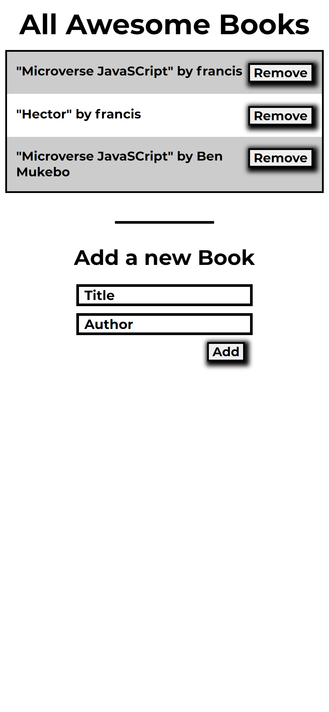
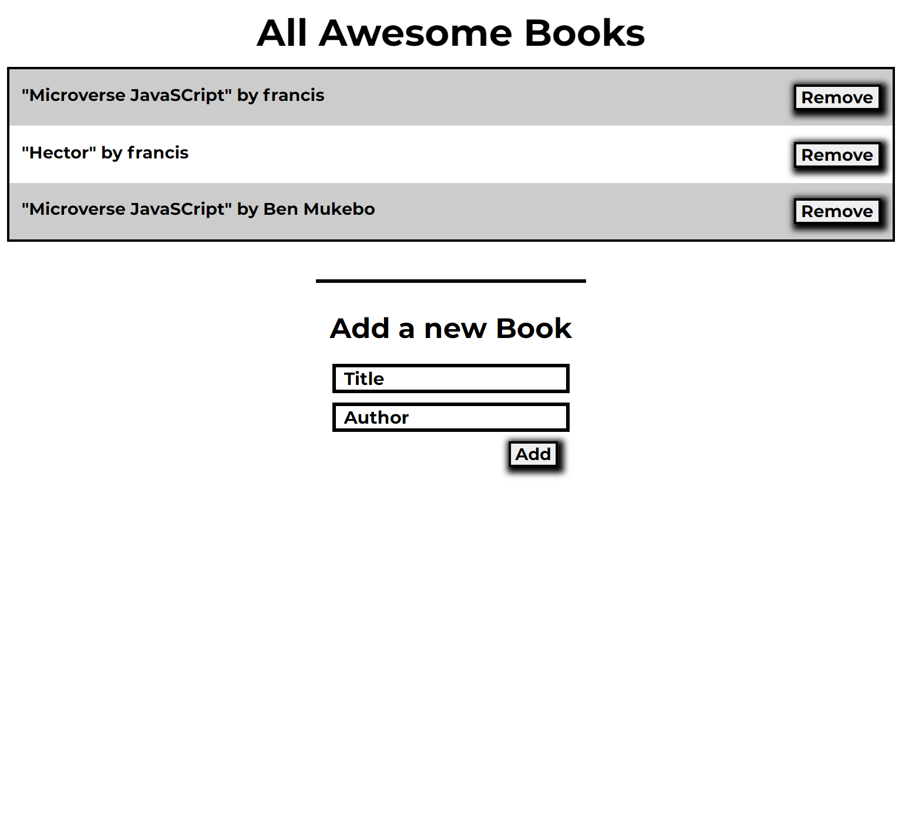

# Awesome-Books
> This is a low wireframed project that shows the features of a booklist section when inputted in two form inputs (The Title and The Author)

> |Mobile Version|Desktop Version|
> |--------------|---------------|
> |.||

- The Page displays the low wireframe design of how a booklist will be displayed in the later stages of development.

- There are two form controls
  - The Title Form Control
  - The Author Form Control

- The values of the form control should be dynamically created in the DOM when the *`Add`* button is clicked.

- The values of the form control which is dynamically displayed on the page should be removed when the *`Remove`* button is clicked.

## Built With

- HTML, CSS, JavaScript
- Git, Github

## Prerequisites
Basic understanding of HTML, JavaScript, CSS Git and GitHub

[Live Demo Link](https://benmukebo.github.io/Awesome-Books/)

## Getting Started

### To get a local copy up and running follow these simple example steps below:

1. Copy this website **``https://github.com/BenMukebo/Awesome-Books``**
2. Navigate to the location of the folder in your machine you wish to save this folder:
**``you@your-Pc-name:~$ cd <folder>``**
3. Clone this repository or download the Zip folder:
**``git clone https://github.com/BenMukebo/Awesome-Books.git``**
4. Change Directory into the cloned repository: **``you@your-Pc-name:~$ cd <Awesome-Books>``**
5. Open the repository with Visual Code Editor: **``you@your-Pc-name:~$ code .``** or open with any code editor of your choice.

## Authors

👤 **Francis Nzenwa Ugorji**

- GitHub: [@Gambit142](https://github.com/Gambit142)
  
- LinkedIn: [Francis Ugorji](www.linkedin.com/in/francis-ugorji-a567b7168)

👤 **Ben Mukebo**

- GitHub: [BenMukebo](https://github.com/BenMukebo)
  
- LinkedIn: [Ben Mukebo](www.linkedin.com/in/kasongo-mukebo-ben-591720205)

## 🤝 Contributing

Contributions, issues, and feature requests are welcome!

Feel free to check the [issues page](../../issues/).

## Show your sup

Give a ⭐️ if you like this project!

## Acknowledgments

- **``Microverse``** for the opportunity to underatake such project using their platform
- 
- To family and friends who motivated us throughout this project

## 📝 License

This project is [MIT](./MIT.md) |licensed.
